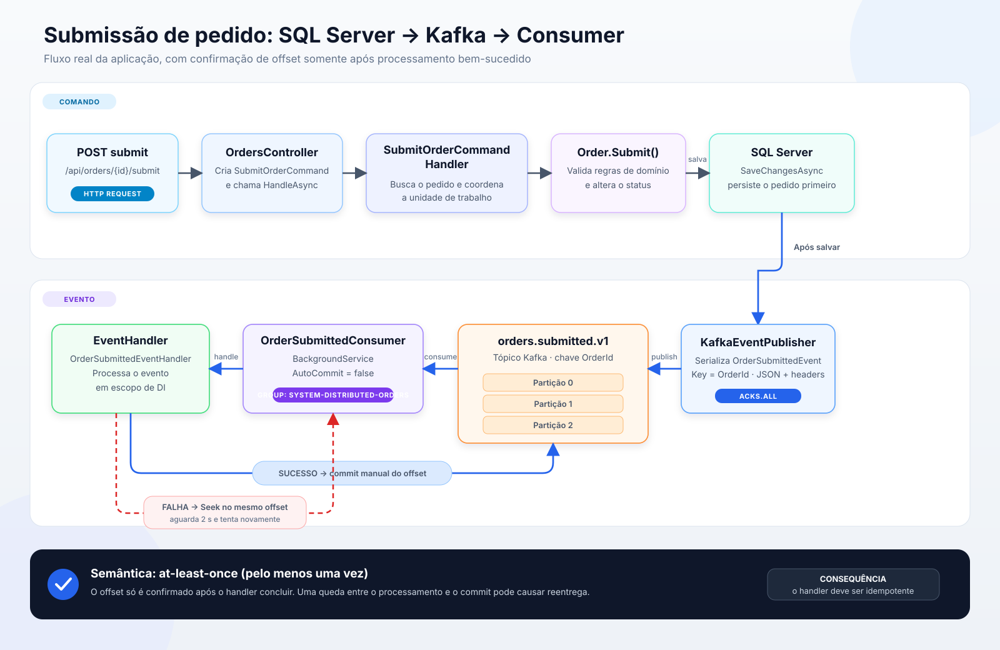

# System Distributed Orders

API de gerenciamento de pedidos construída com .NET 10, Clean Architecture, SQL Server, Entity Framework Core e Apache Kafka. O projeto cobre o ciclo básico de um pedido, mantém as regras de negócio no domínio e publica um evento assíncrono quando o pedido é submetido.

## Visão geral

O sistema permite:

- consultar um catálogo inicial de produtos;
- criar pedidos para um cliente;
- adicionar produtos ao pedido;
- acumular a quantidade quando o mesmo produto é adicionado novamente;
- submeter um pedido para pagamento;
- publicar `OrderSubmittedEvent` no Kafka;
- consumir o evento em segundo plano com commit manual;
- marcar pedidos como pagos;
- cancelar pedidos conforme as regras do domínio;
- consultar um pedido ou listar todos os pedidos;
- aplicar migrations e cadastrar os produtos iniciais automaticamente;
- explorar e executar a API pelo Swagger UI;
- executar testes de domínio, aplicação, infraestrutura e API.

## Arquitetura

O código segue os princípios de Clean Architecture: as regras de negócio ficam nas camadas internas e os detalhes externos, como HTTP, SQL Server e Kafka, permanecem nas camadas externas.


### Dependências entre projetos

| Projeto | Responsabilidade | Dependências internas |
| --- | --- | --- |
| `SystemDistributedOrders.Domain` | Entidades, estados e regras de negócio | Nenhuma |
| `SystemDistributedOrders.Contracts` | Contratos compartilhados de integração | Nenhuma |
| `SystemDistributedOrders.Application` | Casos de uso, DTOs, commands, queries e abstrações | Domain e Contracts |
| `SystemDistributedOrders.Infrastructure` | EF Core, SQL Server, repositórios, producer e consumer Kafka | Application e Domain |
| `SystemDistributedOrders.Api` | Controllers, Swagger, tratamento HTTP e composition root | Application e Infrastructure |

Regra principal: as camadas internas não conhecem ASP.NET Core, Entity Framework Core ou Confluent.Kafka. A Application declara interfaces, e a Infrastructure fornece as implementações.

### Estrutura de diretórios

```text
SystemDistributedOrders/
├── Images/                                  # Diagramas da documentação
├── src/
│   ├── SystemDistributedOrders.Api/         # HTTP, Swagger e inicialização
│   ├── SystemDistributedOrders.Application/ # Casos de uso e abstrações
│   ├── SystemDistributedOrders.Contracts/   # Eventos de integração
│   ├── SystemDistributedOrders.Domain/      # Entidades e regras do domínio
│   └── SystemDistributedOrders.Infrastructure/
│       ├── Messaging/Kafka/                 # Producer, consumer e handler
│       └── Persistence/                     # DbContext, mappings e migrations
├── tests/
│   ├── SystemDistributedOrders.Api.Tests/
│   ├── SystemDistributedOrders.Application.Tests/
│   ├── SystemDistributedOrders.Domain.Tests/
│   └── SystemDistributedOrders.Infrastructure.Tests/
├── compose.yaml                             # Kafka local
├── dotnet-tools.json                        # dotnet-ef local
└── SystemDistributedOrders.slnx
```

## Execução local

A API e o SQL Server executam diretamente na máquina. Apenas o Kafka é iniciado pelo Docker Compose.


### Pré-requisitos

- [.NET 10 SDK](https://dotnet.microsoft.com/download/dotnet/10.0);
- Docker Desktop com suporte ao comando `docker compose`;
- SQL Server local;
- PowerShell, terminal ou uma IDE compatível com .NET;
- portas `5148` e `9092` disponíveis.

A configuração padrão usa autenticação integrada do Windows:

```text
Server=localhost;Database=SystemDistributedOrders;Trusted_Connection=True;TrustServerCertificate=True
```

Se sua instância, porta ou autenticação forem diferentes, altere `ConnectionStrings:SqlServer` em `src/SystemDistributedOrders.Api/appsettings.json` ou sobrescreva por variável de ambiente.

### 1. Entre na raiz do projeto

```powershell
cd C:\SystemDistributedOrders
```

### 2. Inicie o Kafka

```powershell
docker compose up -d
```

Confirme que o broker está saudável:

```powershell
docker compose ps
docker compose logs -f kafka
```

Use `Ctrl+C` para sair da visualização dos logs; o contêiner continuará executando.

O Compose inicia um único nó Kafka em modo KRaft, sem ZooKeeper, disponível em `localhost:9092`. O tópico possui três partições por padrão e pode ser criado automaticamente no primeiro envio.

### 3. Restaure as dependências

```powershell
dotnet restore SystemDistributedOrders.slnx
```

### 4. Execute a API

```powershell
dotnet run --project src/SystemDistributedOrders.Api --launch-profile http
```

Durante a inicialização, a aplicação:

1. conecta ao SQL Server local;
2. aplica as migrations pendentes;
3. cria o banco `SystemDistributedOrders`, caso ainda não exista;
4. cadastra os produtos iniciais que estiverem ausentes;
5. inicia o consumer do tópico `orders.submitted.v1`;
6. expõe a API em `http://localhost:5148`.

### 5. Abra o Swagger

```text
http://localhost:5148/swagger
```

O navegador é aberto automaticamente ao usar o perfil `http`. O Swagger fica habilitado somente no ambiente `Development`.

## Teste rápido de ponta a ponta

O arquivo `src/SystemDistributedOrders.Api/SystemDistributedOrders.Api.http` contém todas as requisições e pode ser executado pelo Visual Studio, Rider ou por extensões HTTP compatíveis.

Também é possível testar pelo PowerShell.

### 1. Obtenha um produto

```powershell
$baseUrl = "http://localhost:5148"
$products = Invoke-RestMethod -Method Get -Uri "$baseUrl/api/products"
$productId = $products[0].id
$products
```

### 2. Crie um pedido

```powershell
$customerId = [Guid]::NewGuid()

$order = Invoke-RestMethod `
  -Method Post `
  -Uri "$baseUrl/api/orders" `
  -ContentType "application/json" `
  -Body (@{ customerId = $customerId } | ConvertTo-Json)

$orderId = $order.orderId
$orderId
```

### 3. Adicione um item

```powershell
Invoke-RestMethod `
  -Method Post `
  -Uri "$baseUrl/api/orders/$orderId/items" `
  -ContentType "application/json" `
  -Body (@{
    productId = $productId
    quantity = 2
  } | ConvertTo-Json)
```

### 4. Submeta o pedido

```powershell
Invoke-RestMethod `
  -Method Post `
  -Uri "$baseUrl/api/orders/$orderId/submit"
```

A operação altera o status para `AwaitingPayment`, salva no SQL Server e publica o evento no Kafka. No terminal da API, procure por:

```text
OrderSubmitted processado. EventId: ..., OrderId: ..., CustomerId: ..., Total: ...
```

Essa mensagem confirma que a API publicou e que o consumer processou o evento.

### 5. Consulte o pedido

```powershell
Invoke-RestMethod -Method Get -Uri "$baseUrl/api/orders/$orderId"
```

### 6. Marque como pago

```powershell
Invoke-RestMethod `
  -Method Post `
  -Uri "$baseUrl/api/orders/$orderId/pay"
```

## Endpoints

| Método | Rota | Descrição | Resposta de sucesso |
| --- | --- | --- | --- |
| `GET` | `/api/products` | Lista o catálogo de produtos | `200 OK` |
| `GET` | `/api/products/{productId}` | Consulta um produto | `200 OK` |
| `POST` | `/api/orders` | Cria um pedido em rascunho | `201 Created` |
| `GET` | `/api/orders` | Lista os pedidos | `200 OK` |
| `GET` | `/api/orders/{orderId}` | Consulta um pedido | `200 OK` |
| `POST` | `/api/orders/{orderId}/items` | Adiciona um produto ao pedido | `204 No Content` |
| `POST` | `/api/orders/{orderId}/submit` | Submete e publica o evento Kafka | `204 No Content` |
| `POST` | `/api/orders/{orderId}/pay` | Marca o pedido como pago | `204 No Content` |
| `POST` | `/api/orders/{orderId}/cancel` | Cancela o pedido | `204 No Content` |

### Exemplos de payload

Criar pedido:

```json
{
  "customerId": "77f50e73-1a24-40c5-a134-67a68acc9f8a"
}
```

Adicionar item:

```json
{
  "productId": "00000000-0000-0000-0000-000000000000",
  "quantity": 2
}
```

Erros são retornados como `ProblemDetails`:

- `400 Bad Request`: validação ou argumento inválido;
- `404 Not Found`: pedido ou produto inexistente;
- `409 Conflict`: operação não permitida pelo estado atual;
- `500 Internal Server Error`: falha inesperada.

## Regras de negócio

### Pedido

- Um pedido nasce com status `Draft`.
- O `CustomerId` é obrigatório.
- Somente pedidos em rascunho podem receber itens.
- Produto, nome, preço positivo e quantidade positiva são obrigatórios.
- Adicionar novamente o mesmo produto aumenta sua quantidade.
- Um pedido vazio não pode ser submetido.
- A submissão altera o status de `Draft` para `AwaitingPayment`.
- Apenas pedidos em `AwaitingPayment` podem ser marcados como `Paid`.
- Pedidos `Paid`, `Delivered` ou já `Cancelled` não podem ser cancelados.
- O total é calculado pela soma de `preço × quantidade` dos itens.

### Estados existentes

```text
Draft → AwaitingPayment → Paid → Processing → Shipped → Delivered
  └────────────── Cancelled (quando permitido) ───────────────┘
```

Atualmente, a API expõe transições para submissão, pagamento e cancelamento. Os estados `Processing`, `Shipped` e `Delivered` existem no domínio, mas ainda não possuem endpoints próprios.

## Integração Kafka



### Evento publicado

Tópico:

```text
orders.submitted.v1
```

Contrato `OrderSubmittedEvent`:

```json
{
  "eventId": "4aae2744-3576-49c4-bc3b-bc61a06435a8",
  "orderId": "5726b940-c57d-4b8e-8d22-30dedd52d80b",
  "customerId": "3fa85f64-5717-4562-b3fc-2c963f66afa6",
  "total": 1899.00,
  "submittedAtUtc": "2026-08-03T16:12:35Z",
  "version": 1
}
```

Headers enviados:

| Header | Valor |
| --- | --- |
| `event-type` | `OrderSubmitted` |
| `event-version` | `1` |
| `content-type` | `application/json` |

A chave Kafka é o `OrderId`. Eventos do mesmo pedido são direcionados consistentemente para a mesma partição, preservando a ordem relativa dentro dessa partição.

### Producer

O `KafkaEventPublisher` usa:

- `Acks.All` para aguardar a confirmação exigida pelo broker;
- producer idempotente para reduzir duplicações provocadas por retries internos;
- serialização JSON com os padrões web do `System.Text.Json`;
- reutilização do producer como singleton;
- `Flush` no encerramento da aplicação.

### Consumer

O `OrderSubmittedConsumer` é um `BackgroundService` e usa:

- consumer group `system-distributed-orders`;
- `AutoOffsetReset.Earliest` para um grupo sem offset anterior;
- commit automático desabilitado;
- commit manual somente depois do processamento bem-sucedido;
- escopo de injeção de dependência por mensagem;
- retorno ao mesmo offset e espera de dois segundos quando o handler falha;
- descarte com commit para JSON inválido ou mensagem vazia.

Essa estratégia oferece processamento **pelo menos uma vez**. Um evento pode ser entregue novamente se a aplicação falhar depois do processamento e antes do commit; handlers com efeitos reais devem ser idempotentes, preferencialmente usando `EventId`.

O handler atual apenas registra os dados do evento no log. Ele é o ponto de extensão para notificações, faturamento ou comunicação com outros serviços.

### Inspecionar o Kafka

Listar tópicos:

```powershell
docker compose exec kafka `
  /opt/kafka/bin/kafka-topics.sh `
  --bootstrap-server localhost:9092 `
  --list
```

Descrever o tópico:

```powershell
docker compose exec kafka `
  /opt/kafka/bin/kafka-topics.sh `
  --bootstrap-server localhost:9092 `
  --describe `
  --topic orders.submitted.v1
```

Ver offsets e lag do consumer:

```powershell
docker compose exec kafka `
  /opt/kafka/bin/kafka-consumer-groups.sh `
  --bootstrap-server localhost:9092 `
  --group system-distributed-orders `
  --describe
```

Depois que todas as mensagens forem processadas, o valor esperado para `LAG` é `0`.

Ler eventos com um grupo de diagnóstico separado:

```powershell
docker compose exec kafka `
  /opt/kafka/bin/kafka-console-consumer.sh `
  --bootstrap-server localhost:9092 `
  --topic orders.submitted.v1 `
  --group readme-debug `
  --from-beginning `
  --property print.key=true `
  --property print.headers=true
```

## Persistência

O Entity Framework Core usa SQL Server e mapeia:

- `Orders`;
- `OrderItems`;
- `Products`.

As migrations são aplicadas automaticamente em ambientes diferentes de `Testing`. O inicializador cadastra dez produtos e evita duplicá-los nas próximas inicializações.

O Kafka grava seus logs em `/var/lib/kafka/data`, associado ao volume nomeado `kafka-data`. Parar ou recriar o contêiner mantém mensagens e offsets enquanto o volume existir.

Para parar o Kafka preservando os dados:

```powershell
docker compose down
```

Para remover também todas as mensagens e offsets armazenados:

```powershell
docker compose down -v
```

> O segundo comando apaga definitivamente o volume Kafka do ambiente local.

## Configuração

As principais opções estão em `src/SystemDistributedOrders.Api/appsettings.json`.

| Chave | Padrão | Finalidade |
| --- | --- | --- |
| `ConnectionStrings:SqlServer` | SQL Server local com Trusted Connection | Banco da aplicação |
| `Kafka:Enabled` | `true` | Liga ou desliga o consumer |
| `Kafka:BootstrapServers` | `localhost:9092` | Endereço do broker |
| `Kafka:OrderSubmittedTopic` | `orders.submitted.v1` | Tópico de submissões |
| `Kafka:OrderSubmittedConsumerGroup` | `system-distributed-orders` | Grupo do consumer |

Variáveis de ambiente usam `__` para representar a hierarquia. Exemplo:

```powershell
$env:Kafka__Enabled = "false"
$env:ConnectionStrings__SqlServer = "Server=localhost;Database=SystemDistributedOrders;Trusted_Connection=True;TrustServerCertificate=True"
dotnet run --project src/SystemDistributedOrders.Api --launch-profile http
```

Observação: `Kafka:Enabled=false` interrompe o consumer. O publisher real ainda será resolvido; para executar o fluxo de submissão sem broker é necessário substituir o publisher, como os testes de API fazem, ou manter o Kafka disponível.

## Migrations

O repositório possui o `dotnet-ef` como ferramenta local.

Restaurar a ferramenta:

```powershell
dotnet tool restore
```

Criar uma nova migration:

```powershell
dotnet ef migrations add NomeDaMigration `
  --project src/SystemDistributedOrders.Infrastructure `
  --startup-project src/SystemDistributedOrders.Api `
  --output-dir Persistence/Migrations
```

Aplicar manualmente:

```powershell
dotnet ef database update `
  --project src/SystemDistributedOrders.Infrastructure `
  --startup-project src/SystemDistributedOrders.Api
```

Normalmente não é necessário executar o segundo comando, pois a API chama `MigrateAsync` ao iniciar.

## Testes

Execute toda a suíte a partir da raiz:

```powershell
dotnet test SystemDistributedOrders.slnx
```

Executar por camada:

```powershell
dotnet test tests/SystemDistributedOrders.Domain.Tests
dotnet test tests/SystemDistributedOrders.Application.Tests
dotnet test tests/SystemDistributedOrders.Infrastructure.Tests
dotnet test tests/SystemDistributedOrders.Api.Tests
```

Cobertura principal:

- regras das entidades `Order` e `Product`;
- publicação de `OrderSubmittedEvent` pelo caso de uso;
- consultas e repositórios com SQLite em memória;
- endpoints da API com `WebApplicationFactory`;
- substituição do publisher Kafka nos testes de API;
- Kafka desabilitado no ambiente `Testing`.

## Tecnologias

- .NET 10 e ASP.NET Core;
- C# com nullable reference types;
- Entity Framework Core 10;
- SQL Server;
- Apache Kafka 4.2 em modo KRaft;
- Confluent.Kafka;
- Swagger/OpenAPI com Swashbuckle;
- Docker Compose;
- xUnit v3;
- SQLite em memória nos testes de infraestrutura e API.

## Limitações e próximos passos

- A gravação no SQL Server e a publicação no Kafka não são atômicas. Uma Transactional Outbox eliminaria a janela entre `SaveChanges` e `ProduceAsync`.
- Não existe Dead Letter Topic; mensagens inválidas são descartadas e falhas de processamento são tentadas indefinidamente.
- O handler consumido atualmente apenas escreve no log.
- Não há autenticação ou autorização nos endpoints.
- Não há endpoints para as transições `Processing`, `Shipped` e `Delivered`.
- Para múltiplos tipos de eventos, convém evoluir headers, versionamento e roteamento dos handlers.
- Observabilidade pode ser ampliada com métricas, tracing distribuído e health checks HTTP.

## Solução de problemas

### A API não conecta ao SQL Server

- Confirme que o serviço SQL Server está iniciado.
- Verifique instância, porta e autenticação na connection string.
- Para SQL Express ou LocalDB, ajuste explicitamente o nome do servidor.
- Confira se o usuário Windows possui permissão para criar/aplicar o banco.

### A API não conecta ao Kafka

```powershell
docker compose ps
docker compose logs kafka
```

Confirme que a porta `9092` não está ocupada e que `Kafka:BootstrapServers` aponta para `localhost:9092`.

### O tópico ainda não aparece

O tópico é criado automaticamente no primeiro envio. Crie um pedido, adicione ao menos um item e execute o endpoint `/submit`.

### O evento foi publicado, mas não aparece novamente no console consumer

Offsets pertencem ao consumer group. Use um novo nome em `--group` para reler desde o início ou consulte os offsets do grupo existente.

### Reiniciar o ambiente Kafka do zero

```powershell
docker compose down -v
docker compose up -d
```

Isso apaga mensagens, tópicos criados e offsets locais antes de iniciar um broker vazio.
